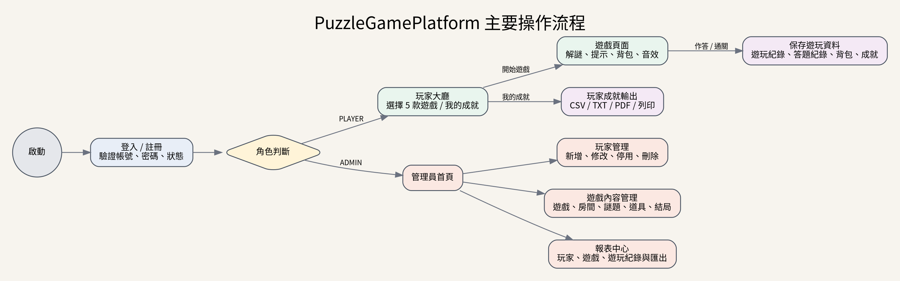

# PuzzleGamePlatform 專案開發報告

## 摘要

PuzzleGamePlatform 是一套以 Java Swing 製作的單機解謎遊戲平台。系統包含玩家註冊與登入、五款不同難度的遊戲關卡、背包與道具資訊、遊戲音效、成就紀錄、管理員玩家管理、遊戲內容管理及報表匯出等功能。資料以 MySQL 8.0 儲存，程式採用 Maven 專案格式，並以 MVC、Service Layer 與 DAO Pattern 分離畫面、商業邏輯、資料存取及資料模型。

專案從 Phase 1 的基本登入與首款遊戲開始，逐步加入角色分流、管理員後台、五款遊戲、資料庫紀錄、報表、音效、成就與介面修正。最終形成一個可以繼續新增遊戲與管理功能的擴充式平台。

---

## 1. 開發環境

### 1.1 軟體環境

| 項目 | 版本或設定 |
|---|---|
| Java Development Kit | JDK 11 |
| Database | MySQL 8.0 |
| Database Schema | `puzzlegame` |
| IDE | Eclipse IDE for Java Developers |
| GUI Designer | WindowBuilder |
| Build Tool | Maven |
| Database Driver | MySQL Connector/J 8.0.33 |
| Character Encoding | UTF-8、MySQL `utf8mb4` |
| Target Platform | macOS 開發／Windows 匯入、測試與打包 |

### 1.2 執行入口

正式啟動類別為：

```text
controller.Application
```

應用程式由 Swing Event Dispatch Thread 啟動 `LoginPage`，避免直接在主執行緒操作 Swing 元件。

### 1.3 資料庫連線

目前開發版 `DbConnection` 預設連線：

```text
jdbc:mysql://localhost:3306/puzzlegame
使用者：root
密碼：1234
時區：Asia/Taipei
```

以上設定適合本機開發與課程展示。若公開部署，應改用外部設定檔或環境變數，並更換資料庫帳號與密碼。

---

## 2. 開發工具與規則

### 2.1 Eclipse Java SE + WindowBuilder

本專案使用 Eclipse 管理 Java 原始碼、Maven 相依套件及執行設定。Swing 視窗以 Java SE 元件建立，WindowBuilder 可協助配置 JFrame、JDialog、JPanel、JButton、JTable、JTextField 等元件的位置與屬性。

WindowBuilder 適合快速建立桌面介面，但專案仍保留手動整理的 UI 初始化方法，使程式碼不完全依賴視覺化編輯器，並方便後續修改共用樣式、透明度、背景圖片與事件處理。

### 2.2 Maven Project

專案使用標準 Maven 目錄：

```text
src/main/java
src/main/resources
src/test/java
pom.xml
```

`pom.xml` 設定 Java 11、UTF-8、MySQL Connector/J，並使用 Maven Shade Plugin 將相依套件一起打包為可執行 Fat JAR。

建置指令：

```bash
mvn clean package
```

輸出檔案：

```text
target/PuzzleGamePlatform-Phase2.jar
```

### 2.3 MVC + DAO Pattern

本專案採用分層設計：

1. **View / Controller**：負責 Swing 畫面、按鈕事件、輸入驗證及頁面切換。
2. **Service**：負責登入、玩家管理、遊戲管理、報表與成就等商業邏輯。
3. **GameEngine**：負責遊戲開始、答題、進度、取得道具、結局與成就解鎖。
4. **DAO**：負責 SQL、CRUD、交易與資料庫查詢。
5. **Entity / Model**：保存玩家、遊戲、謎題、紀錄與報表資料。
6. **Util**：提供資料庫連線、音效及檔案匯出等共用功能。


### 2.4 程式設計規則

- Java 原始碼以 UTF-8 儲存。
- 使用 Java 11 相容語法，避免依賴更新版本功能。
- 資料庫操作集中在 DAO，不在 Swing 頁面直接撰寫 SQL。
- Service 負責輸入驗證與跨 DAO 商業流程。
- 永久刪除玩家使用交易，避免只刪除主表而留下關聯資料。
- 圖片與音效放在 `src/main/resources`，使用 classpath 載入，確保 JAR 中仍可使用。
- 報表輸出統一交由 `ReportExporter` 處理。
- 中文內容使用 Java 邏輯字型及顯示安全轉換，降低 Windows 字型差異造成的方框或亂碼。

---

## 3. 資料夾與分層說明

```text
puzzle-game-platform/
├─ database/
│  ├─ puzzlegameplatform_phase1_full.sql
│  ├─ puzzlegameplatform_phase1_upgrade.sql
│  ├─ puzzlegameplatform_phase2_full.sql
│  ├─ puzzlegameplatform_phase2_upgrade.sql
│  └─ puzzlegameplatform_phase2_gameplay_upgrade.sql
├─ src/main/java/
│  ├─ controller/
│  │  ├─ Application.java
│  │  ├─ LoginPage.java
│  │  ├─ RegisterPage.java
│  │  ├─ GameMainPage.java
│  │  ├─ admin/
│  │  ├─ games/
│  │  └─ player/
│  ├─ entity/
│  ├─ dao/
│  │  └─ impl/
│  ├─ service/
│  │  ├─ engine/
│  │  └─ impl/
│  ├─ util/
│  └─ test/
├─ src/main/resources/
│  ├─ images/
│  └─ sounds/
├─ pom.xml
├─ BUILD_PHASE2_WINDOWS.bat
└─ RUN_PHASE2_WINDOWS.bat
```

### 3.1 `controller`

負責所有 UI 與畫面流程。

- `Application`：應用程式入口。
- `LoginPage`：登入、角色分流。
- `RegisterPage`：玩家註冊。
- `GameMainPage`：玩家大廳、五款遊戲入口、我的成就、登出。

### 3.2 `controller/admin`

管理員功能：

- `AdminMainPage`：管理員首頁。
- `PlayerManagementPage`：玩家 CRUD、搜尋、啟用、停用與永久刪除。
- `GameManagementPage`：遊戲、房間、謎題、道具、結局五個管理分頁。
- `ReportCenterPage`：平台統計、玩家報表、遊戲報表及遊玩紀錄報表。
- `AdminStyle`：管理員頁面共用顏色與元件樣式。

### 3.3 `controller/games`

五款遊戲頁面：

- `LibraryGamePage`
- `ClockTowerGamePage`
- `HospitalGamePage`
- `LaboratoryGamePage`
- `MirrorHotelGamePage`

其中四款故事型遊戲共用 `StoryPuzzleGamePage`，減少重複的題目切換、提示、背包、音效與答題 UI 程式碼。

### 3.4 `controller/games/common`

`BackpackDialog` 顯示目前遊玩紀錄取得的道具。玩家點擊紙條或道具後，可查看完整內容、密碼與線索。

### 3.5 `controller/player`

`PlayerAchievementDialog` 只查詢目前登入玩家的成就，顯示成就名稱、遊戲、說明、條件、狀態及解鎖時間，並支援 CSV、TXT、PDF 與印表機輸出。

### 3.6 `entity`

對應資料表及報表欄位的 Java Model，例如：

- `Player`
- `Game`
- `Room`
- `Puzzle`
- `Item`
- `Ending`
- `Achievement`
- `PlayerGameRecord`
- `PuzzleRecord`
- `Inventory`
- `SaveGame`
- `PlayerAchievement`
- `GameRecordReportRow`
- `ReportSummary`

### 3.7 `dao` 與 `dao/impl`

DAO 介面定義資料操作方法，`impl` 內使用 JDBC 實作 SQL。這種做法可以讓 Service 不需要知道 SQL 細節，也方便未來更換資料庫或補上測試替身。

### 3.8 `service` 與遊戲引擎

- `PlayerService`：註冊、登入及玩家管理。
- `GameService`：遊戲內容查詢與 CRUD。
- `AdminReportService`：平台統計與報表資料。
- `PlayerAchievementService`：玩家個人成就查詢。
- `GameEngine`：遊戲開始、物件互動與答案提交介面。
- `LibraryGameEngine`：圖書館專用互動式引擎。
- `StoryGameEngine`：其他四款故事關卡共用引擎。
- `GameDefinitions`：集中定義關卡文字、答案、提示、獎勵道具與音效。

### 3.9 `util`

- `DbConnection`：建立 MySQL Connection。
- `ReportExporter`：CSV、TXT、中文 PDF 匯出。
- `SoundPlayer`：載入及播放 classpath WAV 音效。

### 3.10 `resources`

- `images`：登入背景、圖書館背景及四款遊戲背景。
- `sounds`：20 個 WAV 音效。

---

## 4. 系統功能與流程



### 4.1 登入與角色分流

玩家輸入帳號及密碼後，系統透過 `PlayerService` 查詢資料庫。只有 `status = ACTIVE` 的帳號可登入。登入成功後：

- `ADMIN` 進入管理員首頁。
- `PLAYER` 進入遊戲大廳。

系統會更新玩家最後登入時間。

### 4.2 玩家遊戲流程

1. 玩家在大廳選擇啟用中的遊戲。
2. GameEngine 建立一筆 `player_game_record`。
3. 玩家閱讀題目、使用提示及輸入答案。
4. 每次作答寫入 `puzzle_record`。
5. 解開謎題後，道具寫入 `inventory`。
6. 玩家可從背包重新查看紙條、公式、密碼與鑰匙資訊。
7. 通關時更新 `ending_no`、完成狀態與結束時間。
8. 系統新增 `player_achievement`，記錄成就與解鎖時間。

### 4.3 管理員玩家管理

管理員可搜尋與維護玩家資料，包含名稱、帳號、密碼、角色及狀態。系統保護目前登入管理員，不能將自己停用、降為玩家或永久刪除。

永久刪除玩家時，會在交易中依序清理：

- `save_game`
- `inventory`
- `puzzle_record`
- `player_achievement`
- `player_game_record`
- `player`

若流程中任一步驟失敗，交易會回滾，避免資料只刪除一半。

### 4.4 管理員遊戲內容管理

管理頁面分為五個分頁：

1. 遊戲：名稱、難度、說明、啟用狀態與背景路徑。
2. 房間：所屬遊戲、名稱、說明及順序。
3. 謎題：所屬遊戲／房間、答案、提示及順序。
4. 道具：所屬遊戲、類型與內容。
5. 結局：所屬遊戲、類型與說明。

遊戲停用後，玩家大廳的按鈕會顯示為「目前停用」。新增全新遊戲資料時，仍需另外新增對應 Java 遊戲頁面及 GameEngine，才能從大廳啟動。

### 4.5 報表功能

管理員報表中心提供：

- 玩家總數與啟用玩家數。
- 遊戲總數與啟用遊戲數。
- 遊玩紀錄數與成功通關數。
- 玩家明細。
- 遊戲明細。
- 玩家遊玩紀錄。

`vw_player_game_record` 將玩家、遊戲、房間、謎題、結局及遊玩狀態整合為報表資料。報表可依關鍵字即時篩選，並只輸出目前畫面上的篩選結果。

---

## 5. 遊戲說明

### 5.1 失落的圖書館（簡單）

玩家在古老藏書室中尋找紙條、觀察停止的時鐘、解開百科全書頁碼與密碼盒。流程偏向物件互動與直覺觀察，適合作為入門關卡。

主要流程：

1. 點擊書櫃取得泛黃便條紙。
2. 根據時鐘 8:15 解開頁碼 `815`。
3. 啟動地球儀機關取得小鑰匙。
4. 打開抽屜取得密碼 `2580`。
5. 開啟密碼盒取得出口鑰匙。
6. 打開出口門並解鎖「圖書館逃脫者」。

### 5.2 逆行的鐘塔（普通）

鐘塔在午夜後開始逆向運轉。玩家需運用鏡面時間與齒輪轉速關係，最後組合校準碼。

主要題目：

- 鏡面鐘盤：由 21:40 的鏡面顯示推算真實時間 `0220`。
- 三聯齒輪：根據 12、36、18 齒及兩次咬合，求出 C 齒輪為 `6 順時針`。
- 午夜校準：將 02:20 換成 140 分鐘，再加上 6 × 15，得到 `0230`。

通關後解鎖「時間修復者」。

### 5.3 霧鎖病棟（普通）

荒廢病棟被白霧封鎖。玩家需閱讀封存病歷、輪班表及電梯規則。

主要題目：

- 鎮靜分類：在虛構遊戲選項中辨識「苯二氮平類」為第 `3` 項。
- 夜班交會日：4 天與 6 天的週期，以第 2 天為共同起點，答案為第 `14` 天。
- 電梯權限：第一題選項 3 × 100 + 14，得到 `314`。

通關後解鎖「霧中生還者」。藥物題只用於遊戲分類，不是醫療建議。

### 5.4 沉沒實驗室（困難）

海底基地逐漸失效，玩家需完成物理與數學計算才能啟動逃生艙。

主要題目：

- 艙壓平衡：使用 `P1 × V1 = P2 × V2`，由 240 kPa、3 L 變為 5 L，答案為 `144` kPa。
- 聲納回波：1500 m/s × 2.4 s ÷ 2，距離為 `1800` m。
- 逃生艙校驗碼：(1 + 4 + 4) × (1800 ÷ 100)，得到 `162`。

通關後解鎖「深海逃生者」。

### 5.5 鏡廳旅館（困難）

旅館中的鏡子會扭曲數字與名字。玩家需使用反轉序列、Atbash 及字母序號總和。

主要題目：

- 倒映房名：反轉 13、15、15、18，再轉換成字母，得到 `ROOM`。
- 鏡像姓名：Atbash 將 `XLFMG` 解為 `COUNT`。
- 主鏡封印：ROOM 字母總和 61，COUNT 字母總和 73，答案為 `6173`。

通關後解鎖「鏡界守名者」。

### 5.6 背包與音效

所有遊戲頁面都有背包按鈕。道具取得後會依遊玩紀錄保存，玩家可點擊查看：

- 紙條及文字線索。
- 齒輪比、公式及聲納資料。
- 密碼與校驗碼。
- 小鑰匙、磁卡、晶片與主鏡銀鑰。

遊戲內含 20 個 WAV 音效，例如齒輪、鐘聲、抽屜、藥櫃、電梯、聲納、逃生艙與鏡子碎裂。玩家可在遊戲頁面切換音效開關。

---

## 6. 資料庫設計與 ER Model


### 6.1 資料表

| 資料表 | 內容 |
|---|---|
| `player` | 玩家、管理員、角色、狀態及登入時間。 |
| `game` | 遊戲名稱、難度、說明、啟用狀態與背景路徑。 |
| `room` | 遊戲房間及排序。 |
| `puzzle` | 謎題、答案、提示及順序。 |
| `item` | 道具名稱、類型及可顯示內容。 |
| `ending` | 結局名稱、類型及說明。 |
| `achievement` | 成就名稱、說明及條件。 |
| `player_game_record` | 玩家每次遊玩的進度、結果與時間。 |
| `puzzle_record` | 每次答案輸入及正確性。 |
| `inventory` | 每筆遊玩紀錄取得的道具。 |
| `save_game` | 遊戲存檔擴充資料。 |
| `player_achievement` | 玩家與成就關聯及解鎖時間。 |

### 6.2 重要關聯

- 一位玩家可以有多筆遊玩紀錄。
- 一款遊戲可以有多個房間、謎題、道具、結局及成就。
- 一筆遊玩紀錄可以有多筆答題紀錄及多個背包道具。
- 玩家與成就是多對多關係，以 `player_achievement` 連接。
- `save_game` 同時關聯遊玩紀錄、玩家與遊戲。

### 6.3 資料完整性

- `player.account` 為唯一值。
- `inventory(record_no, item_no)` 為唯一組合，避免同一遊玩紀錄重複加入相同道具。
- `player_achievement(player_no, achievement_no)` 為唯一組合，避免同一成就重複解鎖。
- 外鍵確保遊戲內容與玩家紀錄具有正確來源。

---

## 7. 報表輸出設計

### 7.1 CSV

CSV 使用 UTF-8 BOM，使 Windows Excel 可直接辨識中文。所有欄位以雙引號包覆，欄位中的雙引號會進行跳脫。

### 7.2 TXT

TXT 使用 UTF-8 與 Tab 分隔，並加入報表標題、匯出時間與資料筆數，方便閱讀或進一步處理。

### 7.3 PDF

為避免額外 PDF 套件及中文字型嵌入問題，程式先用 Java2D 將表格繪製成頁面影像，再建立多頁 PDF。這個方式可以保留中文字形及固定版面，但文字在 PDF 中主要以影像呈現。

### 7.4 玩家個人成就

玩家成就頁面可輸出：

- CSV
- TXT
- 中文 PDF
- JTable 系統列印

輸出內容只包含目前登入玩家，不會顯示其他玩家資料。

---

## 8. 測試與驗證

目前專案包含：

- 77 個 Java 原始檔。
- 109 個編譯後 class。
- 6 張背景圖片。
- 20 個 WAV 音效。
- 12 張 MySQL 資料表。
- 1 個報表 View。

已進行的檢查：

- `javac --release 11 -encoding UTF-8` 編譯。
- 題目特殊符號與 Windows 字型相容修正。
- Maven Shade Plugin 主類別設定。
- CSV、TXT 與中文 PDF 產生測試。
- 玩家成就查詢與匯出流程檢查。
- ZIP 完整性檢查。

仍應在目標 Windows 電腦完成：

- 真實 MySQL 連線。
- 五款遊戲完整流程。
- WAV 音效裝置播放。
- 系統印表機。
- Maven Fat JAR 執行。
- 圖片、字型與解析度顯示。

---

## 9. 專案開發流程

### 9.1 Phase 1：基礎平台

- 建立 Maven Java 11 專案。
- 完成 MySQL `puzzlegame` Schema。
- 建立 `Application → LoginPage` 流程。
- 加入玩家註冊與角色分流。
- 建立玩家大廳。
- 完成失落的圖書館遊戲及基本 GameEngine。

### 9.2 Phase 2：管理與報表

- 管理員玩家 CRUD。
- 遊戲、房間、謎題、道具與結局管理。
- 平台統計及三類報表。
- CSV、TXT、PDF 匯出。
- Maven Shade Plugin 與 Windows 批次檔。

### 9.3 遊戲體驗強化

- 替換四款遊戲背景。
- 降低對話區不透明度，讓背景更清楚。
- 普通及困難關卡加入多步驟題目。
- 加入背包、道具內容與紙條顯示。
- 加入 20 個 WAV 音效及音效開關。

### 9.4 題目與成就修正

- 將容易失真的下標、箭頭及特殊符號改為穩定文字。
- 使用 Java 邏輯字型及強制重繪，修正透明區文字殘影。
- 玩家大廳新增「我的成就」。
- 加入個人成就 CSV、TXT、PDF 及列印。

---

## 10. 專案心得與 AI 協作心得

### 10.1 專案流程心得

在這個專案中，我最明顯的體會是，一個看似單純的遊戲介面，只要加入登入、資料庫、遊玩紀錄、管理後台與報表，就會變成需要完整架構規劃的應用系統。若所有程式都放在 JFrame 事件中，後續修改會非常困難，因此將程式拆成 Controller、Service、DAO、Entity 與 GameEngine 是必要的。

開發過程也讓我理解資料庫關聯的重要性。例如刪除玩家不能只刪除 `player`，還要考慮遊玩紀錄、答題紀錄、背包、存檔與成就。透過外鍵與交易，可以避免資料遺失或產生孤兒紀錄。遊戲內容也不應全部寫死在畫面中，因此將題目、提示、答案、道具與結局放入資料庫，管理員才有機會在後台維護。

另一個重要經驗是跨環境問題。程式在 Eclipse 可以執行，不代表匯出成 JAR 後仍能正常載入圖片與音效。資源必須放在 `src/main/resources`，並使用 classpath 讀取。中文字型、特殊符號與 PDF 匯出也會受到 Windows、macOS 和 JDK 字型差異影響，因此需要實際渲染與測試，而不能只看程式是否編譯成功。

### 10.2 AI 協作心得

本專案使用 AI 協助整理需求、規劃架構、建立程式骨架、設計 SQL、檢查錯誤與撰寫文件。AI 最有幫助的地方，是能快速將自然語言需求拆成類別、資料表、方法及流程，並在出現例外訊息或畫面問題時，根據程式碼與執行結果提出修正方向。

不過 AI 產生的內容仍需要人工驗證。像是時鐘指針、題目文字顯示、圖片路徑、JAR 資源、MySQL 外鍵與 Windows 字型，都必須由開發者在實際環境中測試。這次的合作方式不是一次生成整個系統，而是反覆進行：

```text
提出需求 → 產生或修改 → Eclipse / MySQL 實測 → 提供錯誤或截圖 → 再修正
```

這個迭代流程讓我逐步理解每個功能背後的原因，而不只是取得一份程式碼。當我可以清楚描述「目前流程、預期結果、實際結果、錯誤訊息與不能改動的部分」時，AI 提供的結果也會更準確。

### 10.3 綜合收穫

透過本專案，我練習到：

- Java Swing 視窗與事件處理。
- MVC、Service Layer 與 DAO Pattern。
- JDBC、MySQL 外鍵、交易與 View。
- Maven 相依管理與 Fat JAR 打包。
- 圖片與音效資源的 classpath 載入。
- 遊戲狀態、背包、成就與報表設計。
- CSV、TXT、PDF 與系統列印。
- 使用 AI 進行需求拆分、除錯、驗證與文件化。

---

## 11. 後續擴充建議

1. 使用 BCrypt 或 Argon2 儲存密碼雜湊。
2. 將資料庫連線資訊移到環境變數或外部設定檔。
3. 完成多存檔介面及讀取存檔功能。
4. 新增更多房間、分支結局與隨機題庫。
5. 加入完成時間、錯誤次數、提示次數及排行榜。
6. 管理員權限分級及操作稽核。
7. 增加 JUnit、DAO Integration Test 與 CI 自動建置。
8. 將 Swing 介面升級為 JavaFX，或改為 Web API + 前端架構。
9. 增加音量控制、背景音樂與無障礙設定。
10. 將題目內容與 GameDefinition 完全資料驅動化，降低新增遊戲時需要修改 Java 程式的比例。

---

## 12. 結論

PuzzleGamePlatform 已從單一解謎畫面發展為具有登入、角色、五款遊戲、背包、音效、成就、管理員 CRUD、資料庫及報表的完整 Maven 專案。MVC + DAO Pattern 使各功能具有清楚責任，MySQL 外鍵與交易確保資料一致性，資源與報表功能則提升了實際可用性。

本專案適合作為 Java SE、Swing、JDBC、MySQL、Maven 與軟體分層設計的整合成果，也能作為後續新增關卡、多人功能或改造成 Web 系統的基礎。
