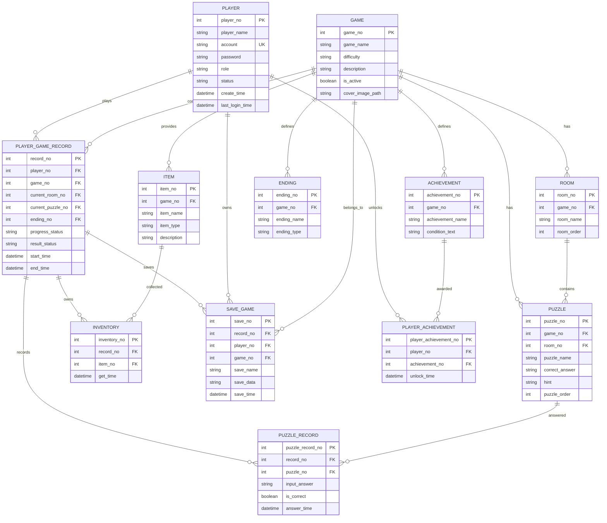

# PuzzleGamePlatform

> 以 Java Swing 製作的單機解謎遊戲平台，整合玩家登入、五款故事關卡、背包與音效、成就系統、管理員後台、MySQL 資料持久化及報表匯出。


## 專案簡介

`PuzzleGamePlatform` 是一套以密室逃脫與劇情解謎為核心的桌面遊戲平台。玩家可以註冊、登入並進入遊戲大廳，挑戰不同難度的關卡；遊戲過程會記錄答題結果、目前進度、取得道具、結局與成就。管理員則可在後台維護玩家與遊戲內容，並輸出玩家、遊戲及遊玩紀錄報表。

本專案使用 **Java 11、Java Swing、Maven、MySQL 8.0**，並遵守 **MVC + DAO Pattern**，將畫面、商業邏輯、資料存取與資料模型分離，方便後續維護與擴充。

## 主要功能

### 玩家端

- 玩家註冊、登入、登出與帳號狀態驗證
- 依照資料庫設定顯示遊戲名稱、難度、說明與啟用狀態
- 五款完整解謎遊戲
- 題目提示、答案驗證與答題紀錄
- 背包系統：查看已取得的紙條、線索、鑰匙與資料片
- 點擊道具顯示內容或密碼提示
- 每個關卡可開啟或關閉音效
- 遊戲進度、結局、成就與解鎖時間保存至 MySQL
- 「我的成就」視窗
- 個人成就紀錄支援 CSV、TXT、PDF 匯出與系統列印

### 管理員端

- 玩家搜尋、新增、修改、停用、啟用與永久刪除
- 防止目前登入管理員停用、降級或刪除自己
- 永久刪除玩家時，以交易清除相關存檔、背包、答題、成就與遊玩紀錄
- 遊戲內容管理：
  - 遊戲
  - 房間
  - 謎題
  - 道具
  - 結局
- 報表中心：
  - 平台統計
  - 玩家資料報表
  - 遊戲資料報表
  - 遊玩紀錄報表
- 報表支援關鍵字篩選與 CSV、TXT、中文 PDF 匯出

## 遊戲列表

| 編號 | 遊戲名稱 | 難度 | 核心玩法 |
|---:|---|---|---|
| 1 | 失落的圖書館 | 簡單 | 尋找便條紙、觀察時鐘、解開頁碼與密碼盒，取得出口鑰匙。 |
| 2 | 逆行的鐘塔 | 普通 | 破解鏡面時間、齒輪比及午夜校準碼，修復逆行鐘塔。 |
| 3 | 霧鎖病棟 | 普通 | 解讀藥物分類、輪班週期與電梯權限碼，穿越封鎖病棟。 |
| 4 | 沉沒實驗室 | 困難 | 使用氣體定律、聲納回波與多步運算，啟動海底逃生艙。 |
| 5 | 鏡廳旅館 | 困難 | 破解反向字母序列、Atbash 與字母序號總和，封印主鏡。 |

> 病院關卡中的藥物內容僅為虛構遊戲分類線索，不構成醫療建議。

## 技術與開發環境

| 類別 | 使用技術 |
|---|---|
| JDK | JDK 11 |
| Database | MySQL 8.0，Schema：`puzzlegame` |
| IDE | Eclipse IDE for Java Developers |
| GUI | Java Swing + WindowBuilder |
| Build Tool | Maven |
| Database Access | JDBC + MySQL Connector/J 8.0.33 |
| Architecture | MVC + DAO Pattern + Service Layer |
| Packaging | Maven Shade Plugin 可執行 Fat JAR |
| Character Encoding | UTF-8 / MySQL `utf8mb4` |

## 系統架構


主要呼叫方向：

```text
View / Controller
        ↓
Service / GameEngine
        ↓
DAO Interface / DAO Implementation
        ↓
MySQL 8.0
```

- **Controller / View**：Swing 視窗、玩家操作、管理員後台與遊戲畫面。
- **Service**：登入、玩家管理、遊戲管理、成就與報表等商業邏輯。
- **GameEngine**：處理遊戲開始、作答、背包取得、進度與通關流程。
- **DAO**：封裝 SQL、CRUD、交易、查詢與資料列映射。
- **Entity**：Java 資料模型，對應資料庫實體與報表資料。
- **Util**：資料庫連線、音效播放、CSV/TXT/PDF 匯出。

## 專案流程


1. `controller.Application` 啟動 `LoginPage`。
2. 玩家可註冊或登入，系統驗證帳號、密碼及 `status`。
3. `role = ADMIN` 進入管理員首頁；`role = PLAYER` 進入遊戲大廳。
4. 玩家選擇關卡後建立 `player_game_record`。
5. 作答時保存 `puzzle_record`，取得道具時保存 `inventory`。
6. 通關後更新結局、完成狀態與 `player_achievement`。
7. 管理員可維護資料並從報表中心輸出紀錄。

## 資料夾與分層說明

```text
puzzle-game-platform/
├─ database/                         # MySQL 完整建庫及升級 SQL
├─ src/main/java/
│  ├─ controller/                    # 登入、註冊、玩家大廳
│  │  ├─ admin/                      # 玩家管理、遊戲管理、報表中心
│  │  ├─ games/                      # 五款遊戲介面 UI
│  │  │  ├─ common/                  # 共用背包視窗
│  │  │  └─ story/                   # 共用故事型解謎頁面
│  │  └─ player/                     # 玩家成就查看與輸出
│  ├─ entity/                        # Player、Game、Puzzle、Record 等模型
│  ├─ dao/                           # DAO 介面
│  │  └─ impl/                       # JDBC / SQL 實作
│  ├─ service/                       # Service 介面
│  │  ├─ engine/                     # GameEngine 介面
│  │  └─ impl/                       # 商業邏輯及遊戲引擎實作
│  ├─ util/                          # DbConnection、ReportExporter、SoundPlayer
│  └─ test/                          # 遊戲引擎測試程式
├─ src/main/resources/
│  ├─ images/                        # 登入頁與五款遊戲背景
│  └─ sounds/                        # 20 個 WAV 遊戲音效
├─ pom.xml                           # Maven 與 Shade Plugin 設定
├─ BUILD_PHASE2_WINDOWS.bat          # Windows 一鍵建置
└─ RUN_PHASE2_WINDOWS.bat            # Windows 啟動 JAR
```

## 資料庫設計

完整 ER Model：


### 主要資料表

| 資料表 | 用途 |
|---|---|
| `player` | 玩家與管理員帳號、角色、狀態及登入時間。 |
| `game` | 遊戲基本資料、難度、啟用狀態及背景路徑。 |
| `room` | 遊戲房間與場景資料。 |
| `puzzle` | 題目、答案、提示與排序。 |
| `item` | 紙條、線索、鑰匙與資料片等道具。 |
| `ending` | 遊戲結局資料。 |
| `achievement` | 成就名稱、說明與解鎖條件。 |
| `player_game_record` | 每次玩家遊戲的進度、結果、目前房間／謎題與時間。 |
| `puzzle_record` | 玩家每次輸入答案與正確性。 |
| `inventory` | 每筆遊玩紀錄取得的道具。 |
| `save_game` | 可擴充的遊戲存檔資料。 |
| `player_achievement` | 玩家與成就的多對多關聯及解鎖時間。 |

`vw_player_game_record` 會整合玩家、遊戲、房間、謎題、結局與遊玩紀錄，供管理員報表中心查詢。

<details>
<summary>GitHub Mermaid ER Diagram</summary>



</details>

## 安裝與執行

### 1. 必要軟體

- JDK 11
- MySQL 8.0
- Maven 3.x
- Eclipse（建議安裝 WindowBuilder）

### 2. 建立資料庫

在 MySQL Workbench 開啟並執行：

```text
database/puzzlegameplatform_phase2_full.sql
```

資料庫名稱：

```text
puzzlegame
```

若已有較早版本資料庫，可依序使用 `database` 目錄中的 upgrade SQL。

### 3. 設定資料庫連線

修改：

```text
src/main/java/util/DbConnection.java
```

目前開發環境預設：

```text
URL      jdbc:mysql://localhost:3306/puzzlegame
USER     root
PASSWORD 1234
```

### 4. Eclipse 匯入

1. `File` → `Import`
2. `Maven` → `Existing Maven Projects`
3. 選擇專案根目錄
4. 右鍵專案 → `Maven` → `Update Project`
5. 執行 `controller.Application`

### 5. Maven 建置

```bash
mvn clean package
```

輸出：

```text
target/PuzzleGamePlatform-Phase2.jar
```

執行：

```bash
java -jar target/PuzzleGamePlatform-Phase2.jar
```

Windows 也可使用：

```text
BUILD_PHASE2_WINDOWS.bat
RUN_PHASE2_WINDOWS.bat
```

## 開發用預設帳號

```text
帳號：admin
密碼：Admin@1234
角色：ADMIN
```

> 此帳號及資料庫密碼僅供本機開發與展示。公開部署前應更換密碼，並將連線資訊改為環境變數或外部設定檔。

## 報表與輸出

- CSV：UTF-8 BOM，可直接使用 Excel 開啟中文內容。
- TXT：UTF-8、Tab 分隔。
- PDF：由 Java2D 先產生中文表格頁面，再寫入 PDF，不需額外 PDF 函式庫。
- 玩家成就：除了上述格式，也可直接呼叫系統印表機。

## 音效與資源

`src/main/resources/sounds` 內含 20 個 WAV 音效，例如：

- 齒輪轉動、鐘聲、門鎖
- 書本、紙張、抽屜、密碼盒
- 病院藥櫃、電梯
- 壓力釋放、聲納、逃生艙
- 鏡面低語、鏡子碎裂
- 答題正確、答題錯誤與背包操作

資源使用 classpath 路徑載入，因此 Maven 打包成 JAR 後仍可使用。

## 專案驗證狀態

- Java 11 相容原始檔：77 個
- Java 編譯輸出：109 個 class
- 背景圖片：6 個
- WAV 音效：20 個
- MySQL 資料表：12 張
- 報表 View：1 個
- 已驗證 CSV、TXT 與中文 PDF 產生流程

實際發布前仍建議在目標 Windows 電腦完成 MySQL、音效裝置、印表機與 Fat JAR 的整合驗收。

## 開發心得與 AI 協作

本專案從單一遊戲頁面逐步發展為具有玩家端、管理員端、資料庫、報表、背包、音效與成就系統的完整平台。開發過程中，先將需求拆分為登入流程、遊戲引擎、資料持久化、管理後台與報表輸出，再分階段實作及驗證，能降低一次修改過多功能造成的風險。

AI 協作在本專案中主要扮演需求整理、架構規劃、程式碼檢查、SQL 設計、錯誤排查與文件整理的角色。使用 AI 並不是直接取代開發者判斷，而是透過反覆描述需求、提供畫面與錯誤訊息、實機測試、再回饋修正，形成「需求 → 生成 → 驗證 → 修正」的迭代流程。這個過程也讓我更清楚理解 MVC、DAO、Service、外鍵關聯、資源路徑、Maven 打包與跨平台字型相容性。

## 後續可擴充方向

- 使用 BCrypt 或 Argon2 儲存密碼雜湊
- 將資料庫帳密移至環境變數或設定檔
- 增加多存檔欄位與讀取存檔介面
- 建立更多房間、分支結局與隨機題庫
- 增加排行榜、完成時間與提示使用次數統計
- 將 Swing UI 升級為 JavaFX 或 Web 前後端架構
- 補充 JUnit、DAO Integration Test 與 CI 自動建置
- 新增管理員權限分級與稽核紀錄

## 文件

- [完整專案報告（Markdown）](docs/PuzzleGamePlatform_Project_Report.md)
- [ER Model PNG](docs/PuzzleGamePlatform_ERModel.png)
- [ER Model SVG](docs/PuzzleGamePlatform_ERModel.svg)
- [系統架構圖](docs/PuzzleGamePlatform_Architecture.png)
- [主要操作流程圖](docs/PuzzleGamePlatform_Flow.png)
