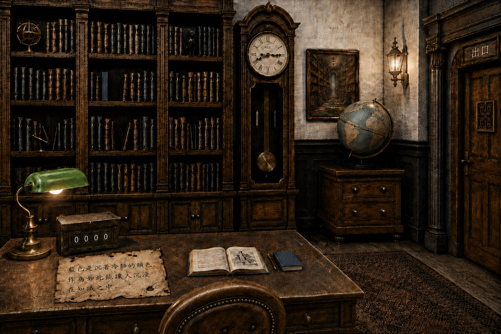
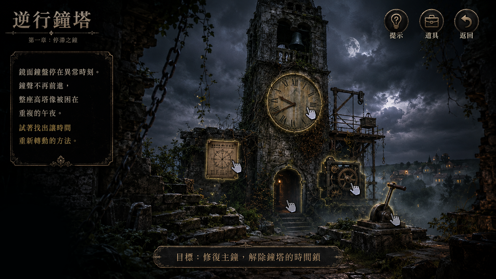
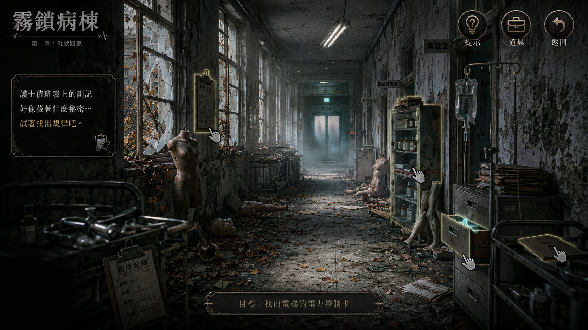
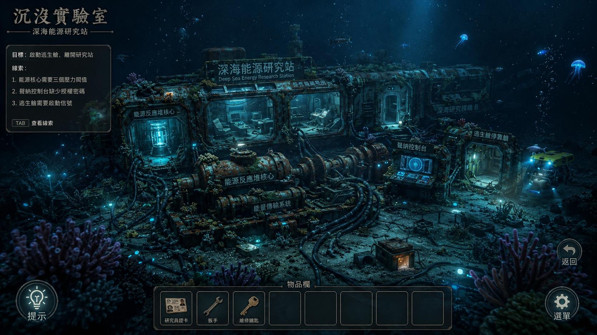
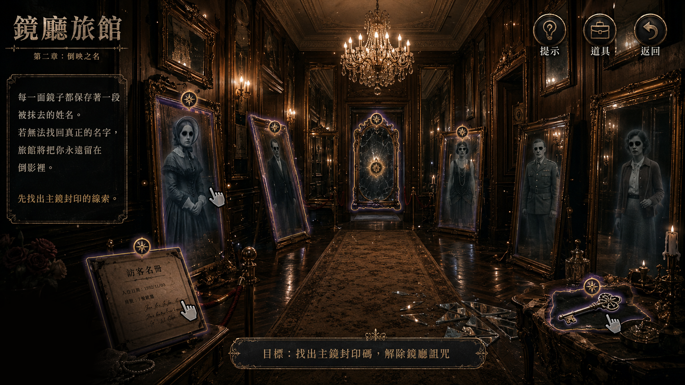

# PuzzleGamePlatform 2.5D V4

> Java Swing × MySQL 密室解謎遊戲平台  
> 本次改版核心：**將原有解謎平台全面升級為可互動的 2.5D 遊戲介面。**

---

## 專案簡介

`PuzzleGamePlatform` 是使用 Java Swing 與 MySQL 開發的桌面密室解謎遊戲平台，包含五款遊戲、玩家帳號、遊戲紀錄、背包、成就、管理員後台與報表功能。

目前版本為：

```text
PuzzleGamePlatform 2.5D V4
```

---

## V1～V4 主要改版

| 版本 | 主要改動 |
|---|---|
| **V1** | 建立登入、註冊、角色分流、遊戲大廳、五款遊戲與基本遊戲紀錄。 |
| **V2** | 新增管理員 CRUD、遊戲內容管理、背包、音效、成就中心與 CSV／TXT／PDF 報表。 |
| **V3** | 將遊戲畫面與操作方式全面升級為 2.5D，加入分層場景、滑鼠視差、互動熱區與浮動題卡。 |
| **V4** | 修正 2.5D 介面細節，移除重複提示、修正缺字方框，並補齊《失落的圖書館》的背包與返回大廳功能。 |

---

# 本版本核心：2.5D 升級

V3～V4 不只是更換背景圖片，而是重新製作遊戲場景、互動方式與介面配置。

## 1. 正式套用 2.5D 遊戲場景

五款遊戲皆使用完整場景畫面呈現：

1. 《失落的圖書館》
2. 《逆行鐘塔》
3. 《霧鎖病棟》
4. 《沉沒實驗室》
5. 《鏡廳旅館》

四款新增遊戲直接使用正式設計的 2.5D UI 圖片，不再以傳統表單或大型固定面板作為主要遊戲畫面。

## 2. 場景互動熱區

場景中的物件可直接點擊，例如：

- 時鐘、齒輪與控制拉桿
- 藥櫃、病歷與電梯
- 反應爐、聲納與逃生艙
- 名冊、肖像與鏡面封印

每個熱區會連結對應的謎題、線索、道具或場景說明。

## 3. 2.5D 分層與視差

新增共用 2.5D 場景架構：

- 前景、中景、背景分層
- 透明 PNG 前景層
- 滑鼠移動視差
- 熱區依深度同步位移
- 暗角、霧氣、粒子與環境光
- 物件懸停發光與點擊回饋

使原本的靜態 Swing 畫面具備更明顯的空間感與互動感。

## 4. 浮動題卡

舊版大型固定操作區會遮住場景，因此改為：

- 點擊場景物件後才顯示題卡
- 題卡顯示在不遮擋物件的位置
- 點擊其他物件可切換內容
- 點擊場景空白處或按 `Esc` 可關閉
- 提示、答題結果與離開確認共用相同視覺風格

---

# V4 關鍵修正

## 移除重複提示

《逆行鐘塔》、《霧鎖病棟》與《鏡廳旅館》右上角已經有提示功能，因此移除左下角重複的書本提示按鈕，並同步移除舊點擊熱區。

## 修正缺字方框

《沉沒實驗室》部分公式中的 Unicode 下標數字，在部分 Windows 字型環境會顯示方框。

公式統一改為：

```text
P1 × V1 = P2 × V2
```

並同步修正 Java 顯示與 SQL 文字內容。

## 補齊《失落的圖書館》功能

新增：

- 背包入口
- 道具內容查看
- 返回遊戲大廳

使五款遊戲的基本操作方式保持一致。

---

## 保留的完整平台功能

2.5D 改版沒有移除原有系統，仍保留：

- 玩家註冊、登入與角色分流
- 五款遊戲與謎題流程
- MySQL 遊戲紀錄與答題紀錄
- 背包與道具系統
- 音效與互動回饋
- 結局與成就
- 管理員玩家及遊戲內容 CRUD
- CSV、TXT、PDF 報表輸出

---

## 技術資訊

| 項目 | 內容 |
|---|---|
| Java | Java 11 |
| GUI | Java Swing |
| Build | Maven |
| Database | MySQL 8.0 |
| Schema | `puzzlegame` |
| Architecture | Controller、Service、DAO、GameEngine |
| Entry Point | `controller.Application` |
| JAR | `target/PuzzleGamePlatform-2.5D-V4.jar` |

---

## 資料庫注意事項

V4 沒有新增或刪除資料表，也沒有修改主要欄位結構。

主要資料庫差異僅為《沉沒實驗室》公式文字的相容性修正，因此既有 V2／V3 資料庫可繼續使用。

首次安裝可匯入：

```text
database/puzzlegameplatform_phase2_full.sql
```

預設連線設定：

```text
Schema：puzzlegame
User：root
Password：1234
Port：3306
```

請依本機環境修改：

```text
src/main/java/util/DbConnection.java
```

---

## Maven 建置

在專案根目錄執行：

```bash
mvn clean package
```

執行產生的 JAR：

```bash
java -jar target/PuzzleGamePlatform-2.5D-V4.jar
```

---

## 遊戲畫面

### 失落的圖書館



### 逆行鐘塔



### 霧鎖病棟



### 沉沒實驗室



### 鏡廳旅館



---

## 改版總結

本次版本最重要的改動，是將原本以 Swing 表單為主的解謎介面，升級為具有場景分層、滑鼠視差、互動熱區、動態效果與浮動題卡的 2.5D 遊戲介面。

V4 進一步完成介面清理與跨遊戲功能一致化，使五款遊戲在保留原有資料庫、背包、成就與管理功能的同時，具備更完整且統一的遊玩體驗。
