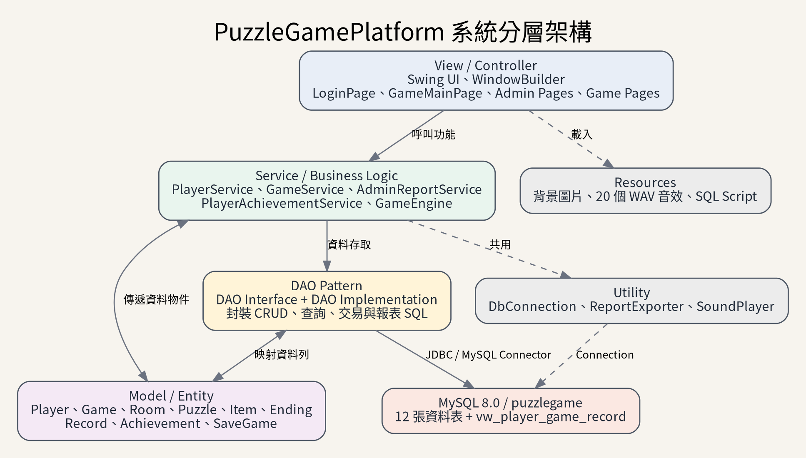
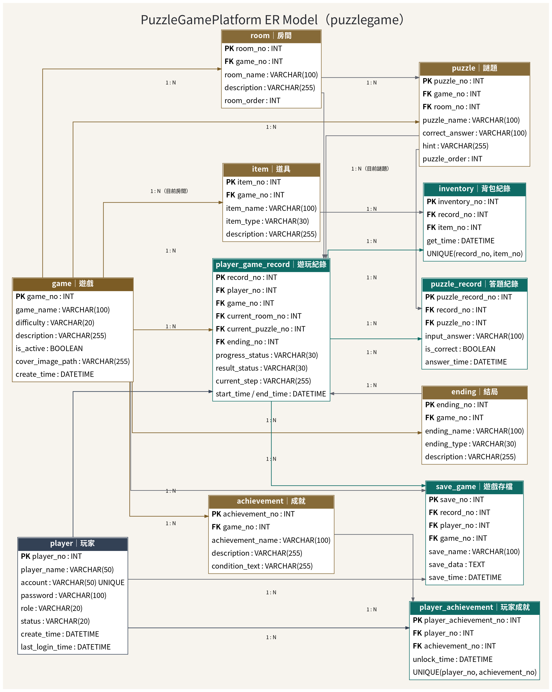

# PuzzleGamePlatform v1.0

以 **Java Swing** 製作的單機解謎遊戲平台，包含玩家系統、五款解謎關卡、背包、音效、成就、管理員後台、MySQL 資料保存及報表輸出。


## 專案功能

### 玩家端

- 註冊、登入、登出與帳號狀態驗證
- 挑戰五款不同難度的解謎遊戲
- 題目提示、答案驗證與遊戲進度保存
- 背包系統：查看紙條、線索、鑰匙及道具資訊
- 遊戲音效開關
- 成就查看、CSV／TXT／PDF 輸出及列印

### 管理員端

- 玩家新增、修改、搜尋、停用、啟用及刪除
- 遊戲、房間、謎題、道具及結局管理
- 玩家、遊戲及遊玩紀錄報表
- CSV、TXT、PDF 匯出

## 遊戲關卡

| 遊戲 | 難度 | 說明 |
|---|---|---|
| 失落的圖書館 | 簡單 | 透過便條、時鐘與密碼線索取得出口鑰匙。 |
| 逆行的鐘塔 | 普通 | 破解鏡面時間、齒輪與鐘塔校準碼。 |
| 霧鎖病棟 | 普通 | 解讀病歷、藥物分類與電梯權限線索。 |
| 沉沒實驗室 | 困難 | 運用氣體定律、聲納及多步計算啟動逃生艙。 |
| 鏡廳旅館 | 困難 | 破解反向字母、鏡像密碼及序號規則。 |

> 遊戲中的醫療與科學內容僅作為虛構解謎素材。

## 開發環境

| 項目 | 技術 |
|---|---|
| JDK | Java 11 |
| 資料庫 | MySQL 8.0 |
| IDE | Eclipse |
| GUI | Java Swing + WindowBuilder |
| 專案管理 | Maven |
| 資料庫連線 | JDBC + MySQL Connector/J |
| 架構 | MVC + Service + DAO Pattern |

## 系統架構

```text
Swing UI / Controller
        ↓
Service / GameEngine
        ↓
DAO / DAO Implementation
        ↓
MySQL 8.0
```



## 資料夾說明

```text
src/main/java/
├─ controller/          # 登入、玩家大廳及主要 UI
│  ├─ admin/            # 管理員後台
│  ├─ games/            # 五款遊戲介面
│  └─ player/           # 玩家成就功能
├─ entity/              # Java 資料模型
├─ dao/                 # DAO 介面與 MySQL 存取
├─ service/             # 商業邏輯與遊戲引擎
└─ util/                # 資料庫、音效及報表工具

src/main/resources/
├─ images/              # 介面與遊戲背景
└─ sounds/              # WAV 遊戲音效

database/               # MySQL 建庫與升級 SQL
docs/                   # ER Model、架構圖、流程圖及完整報告
```

## 資料庫

主要資料表包括：

- `player`：玩家與管理員帳號
- `game`、`room`、`puzzle`：遊戲與題目內容
- `item`、`inventory`：道具與玩家背包
- `player_game_record`、`puzzle_record`：遊玩與答題紀錄
- `achievement`、`player_achievement`：成就資料
- `ending`、`save_game`：結局與存檔



## 安裝與執行

### 1. 建立資料庫

在 MySQL Workbench 執行：

```text
database/puzzlegameplatform_phase2_full.sql
```

資料庫連線設定位置：

```text
src/main/java/util/DbConnection.java
```

### 2. Eclipse 匯入

```text
File → Import → Existing Maven Projects
```

選擇專案資料夾後，執行：

```text
src/main/java/controller/Application.java
```

### 3. Maven 打包

```bash
mvn clean package
java -jar target/PuzzleGamePlatform-Phase2.jar
```

Windows 也可使用：

```text
BUILD_PHASE2_WINDOWS.bat
RUN_PHASE2_WINDOWS.bat
```

## 預設管理員

```text
帳號：admin
密碼：Admin@1234
```

## 專案文件

- [完整專案報告](PuzzleGamePlatform_Documentation/PuzzleGamePlatform_Project_Report.pdf)
- [ER Model](PuzzleGamePlatform_Documentation/PuzzleGamePlatform_ERModel.png)
- [系統架構圖](PuzzleGamePlatform_Documentation/PuzzleGamePlatform_Architecture.png)
- [系統流程圖](PuzzleGamePlatform_Documentation/PuzzleGamePlatform_Flow.png)

## 開發心得

本專案從登入與單一遊戲逐步擴充為包含玩家、管理員、資料庫、背包、音效、成就與報表的完整平台。開發過程透過 AI 協助分析錯誤、整理架構、設計題目與產生文件，但功能需求、測試結果與最終決策仍由開發者確認。這次經驗加深了對 Java Swing、Maven、MySQL、MVC 與 DAO 分層設計的理解。
